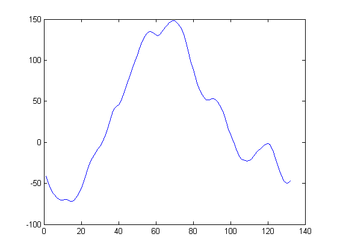
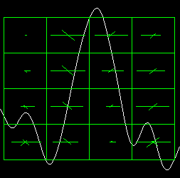
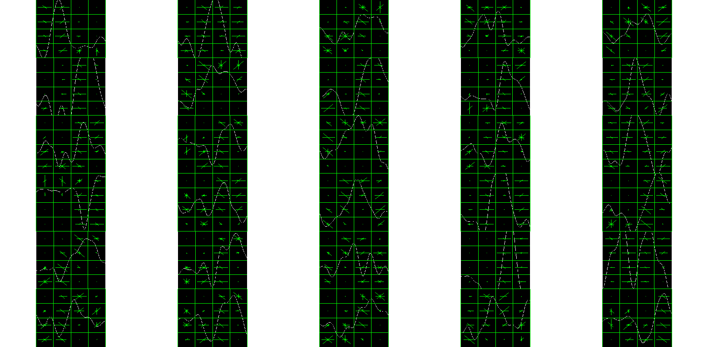

# KComplex

Los componentes KComplex son eventos que se presentan en los EEG, y están relacionados con la etapa 2 del sueño.  Las razones de su nombre quedó perdido en la propia historia de su descubrimiento. Se cree que tiene dos componentes uno endógeno y otro exógeno y que se presentan como mecanismos que tiene el cerebro para descartar información sensorial ambiental y mantener el estado de sueño.

Tienen una amplitud de casi 100 micoVoltios, muy por encima del EEG de fondo, y una forma y caracterización bastante particular.




En  se encuentra el dataset en cuestión, compueseto por 10 extractos de 10 sujetos de 2 hs cada uno, sampleados a Fs=200 Hz en formato EDF.  Para los primeros 5 sujetos, se dispone de dos anotaciones por expertos, que visualmente marcaron las ubicaciones de los KComplex en el dataset, y además se dispone de una marca automática calculada según el algoritmo .

# Primer extracto

Para el primer extracto se analizó el canal Cz-A1 (Cz referenciado bipolarmente a A1).  La primer columna contiene el marcador de tiempo que insertó visualmente el analizador, y en la segunda columna está el largo, también en segundos, del k-complex detectado.

```text
   50.4113	    0.6544
  101.7100	    1.1305
  168.4632	    1.1738
  281.6234	    0.8708
  321.2771	    1.3470
  332.8355	    1.4336
  370.7143	    1.4769
  420.9740	    1.4336
  495.6494	    1.4336
  516.2121	    1.0440
  527.2944	    1.3903
  533.0952	    1.3903
  548.6797	    1.0873
  567.7706	    1.3470
  584.4805	    1.0873
  597.5974	    1.4336
  611.7965	    1.3037
  636.9913	    1.0873
  649.3723	    1.3037
  663.5281	    1.3903
  665.9524	    1.3903
  702.6190	    1.3903
  704.6970	    1.1738
  740.4978	    1.3470
  742.3593	    1.1738
  764.2641	    1.0007
  782.6623	    1.2604
  806.2987	    1.2171
  811.2771	    1.3903
  819.0693	    1.5202
 1254.6104	    1.3470
 1441.5801	    1.3037
 1664.3939	    1.2171
 1683.3983	    1.3037
```


Estos marcadores pueden servir como rótulos para implementar un mecanismo de detección automática.

# Calculando descriptores visuales



El procedimiento de detección procede como sigue: se toma la señal de EEG monocanal, se aplica un filtro band-pass para eliminar las frecuencias mayores a 10 Hz.  Luego se obtiene una bag-of-words de los descriptores correspondientes a las 34 localizaciones que fueron identificadas por un observador visual.   Luego se recorren las dos horas del extracto y se obtienen descriptores para todas las posiciones (359747 descriptores).

Finalmente se calcula la Distancia (K=1) de los casi 360 mil descriptores a los 34 descriptores marcados y se verifican que los mínimos sean encontrados.

# Verificación

Arrancando con la prueba trivial, la función ''D'' se hace 0 en las 34 localizaciones donde están los descriptores de la bolsa.

```matlab
>> find(D==0)

ans =

  Columns 1 through 6

       10082       20342       33693       56325       64256       66567

  Columns 7 through 12

       74143       84195       99130      103243      105459      106619

  Columns 13 through 18

      109736      113554      116896      119520      122359      127398

  Columns 19 through 24

      129875      132706      133191      140524      140939      148100

  Columns 25 through 30

      148472      152853      156533      161260      162256      163814

  Columns 31 through 34

      250922      288316      332879      336680
```      
      
Los descriptores obtenidos son:




```matlab

%%
[IDX, D] = vl_kdtreequery(kdtree,M,TM,'NumNeighbors',1);

fdist=D;
[values,order] = sort(fdist);

eventssample = round(events(:,1)*Fs+1.2604/2*Fs);


tp=zeros(1,size(eventssample,1));
fp=[];

for i=1:size(eventssample,1)
    
    [ids, spdist] = knnsearch(eventssample,order(i),'k',1);
    
    if (spdist<1.26*Fs)
        tp(ids) = 1;
    end
    
end

```

Verificando con K=1 encuentra, trivialmente, los descriptores que corresponden a los kcomplex marcados por el analista 1.  El criterio para la identificación es que el punto donde se encuentra el mínimo en la comparación entre los descriptores, no exceda en más de 1.26 s la ubicación real del k-complex.   Este valor corresponde a la longitud promedio informada x ese mismo analista.


# Con k=7

Con k=7, dentro de los primeros 100 posiciones que minimizan la distancia entre los descriptores en cada una de esas posiciones y los 7 vecinos más cercanos, encuentra de los 34, solo dos.

Si en la bolsa, se ponen sólo 10 descriptores representativos de kcomplex, 

Recién es necesario ver los primeros 10000 valores que minimizan esas distancias, para alcanzar la identificación del 100%.

# Regularizando, y Generalizando.

Dividiendo el "dataset" en dos, es decir, utilizando por ejemplo los primeros 15 descriptores, para identificar los segundos 19.  Buscando los primeros 34 distancias mínimas se encuentran dos de los 19 y hacen falta 11679 valores mínimos hasta encontrar los que corresponden.


Automatic study of KComplex elements in Sleep EEG
* https://en.wikipedia.org/wiki/K-complex
* http://ieeexplore.ieee.org/abstract/document/5626447/
* http://www.tcts.fpms.ac.be/~devuyst/publications/devuyst_EMBC2010.pdf
* https://watermark.silverchair.com/api/watermark?token=AQECAHi208BE49Ooan9kkhW_Ercy7Dm3ZL_9Cf3qfKAc485ysgAAAdAwggHMBgkqhkiG9w0BBwagggG9MIIBuQIBADCCAbIGCSqGSIb3DQEHATAeBglghkgBZQMEAS4wEQQMOuM7n8lElARwm8ZIAgEQgIIBg8JUYxBlB0Wn_QXYccENUPrdIenaMkg2-4w7MR30iWpM3OlhJHMle6YUQ_3Xj91uCKehKJtND8-iqlrvrWeBV1UcYkywCN7TN4dzp44gOdfhl4qAat8I-12LOED2n9lP2HbE8m6HEPEEh368uJ00jIFyTTBqjCcHasijFs-CnKDsYhSnI9okrl3n6FYpDS1y97zKBvTklJ5oTuvozo9jI-CQ2nAIL7AAeQ9buAlgFVpnUuq4IQ8RyTSjtaGWSbLsWbyfQUvlLOkl18kb7CfhaqMe05s3bszs6U_aDCAIN1StSL0m32NBqLlgqkvcxwI8of7Eeepg2pZ7lVpZ-0NewBT6UTucGbPHFzPIhALhkfN9wgooaNHv6Cm8H-NWfWOmbEEUqdBcvtr10Fk98LD5lVXLjNYVweMLHDmmT1BH3IN_cwXyKoKSUa_iNdohzclzJwXV1zaoXJwrqDGj7gEob6DhKbFXdISCCthHwqWgGw-T4vzPVOlWdFpq4QDlF8t7NQlXbA
* https://www.ncbi.nlm.nih.gov/pmc/articles/PMC4516876/
